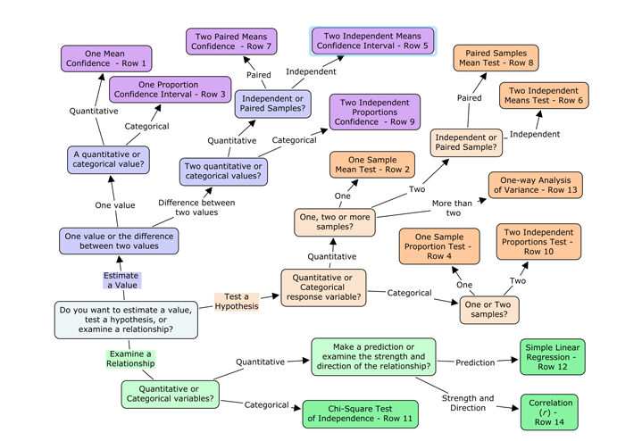

## Statistical methods  

Based on the STAT500 course of Pennsylvania State University, I have a created a 
R markdown script to share a effective and logical table/tree. The goal is to have
a smart guid to find the best statistical technics compared research scenarios.

At each finality have a "Row #". Click on it to find a summary table of the statistical method you choose.  

